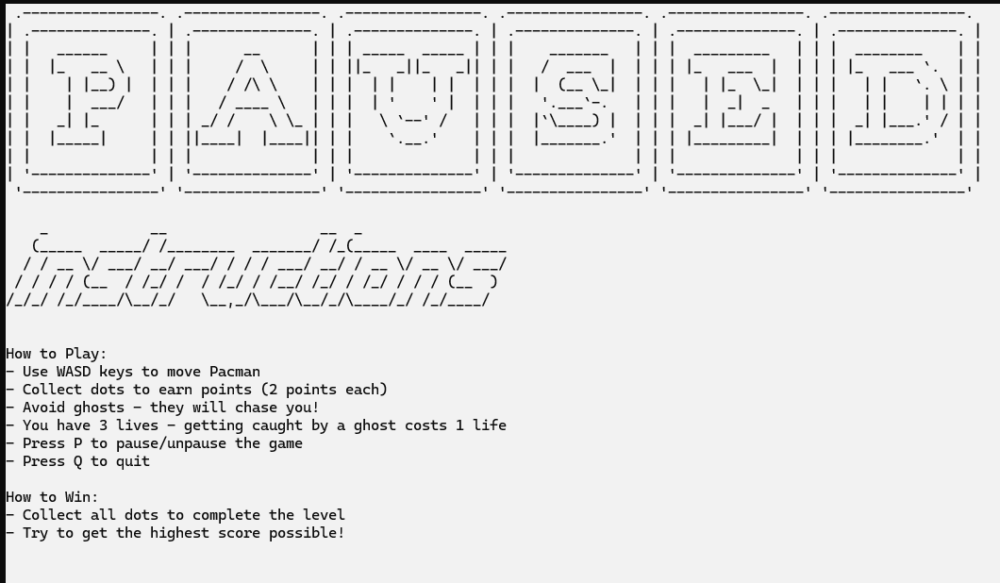

# Pacman Assembly Game

A classic Pacman game implemented in x86 Assembly language for Windows, featuring multiple levels, ghosts with different behaviors, and various gameplay mechanics.



## Features

- **Multiple Levels**: Three unique levels with increasing difficulty
  - Level 1: Classic Pacman gameplay
  - Level 2: Adds sliding walls and a fifth ghost
  - Level 3: Adds teleport pads, cyan and magenta ghosts, and 2x faster ghosts

- **Colorful Graphics**:
  - Colored walls specific to each level (blue, red, green)
  - Colored ghosts (red, brown, green, orange, pink, cyan, magenta)
  - Visual indicators for power-ups and special items

- **Game Mechanics**:
  - Collect dots to earn points (2 points each)
  - Avoid ghosts or lose a life
  - Collect fruits for bonus points (20 points) and power-ups
  - Power-ups allow you to eat ghosts for additional points (50 points)
  - Teleport pads in Level 3 for quick movement across the maze

- **Sound Effects**:
  - MP3 sound playback for game events:
    - Eating pellets
    - Teleporting
    - Death
    - Game over

- **High Score System**:
  - Saves player name, score, and level to a highscores.txt file
  - Scores are sorted by highest score in descending order

- **Game Controls**:
  - WASD keys for movement
  - P to pause/unpause
  - Q to quit

## Requirements

- Windows operating system
- MASM (Microsoft Macro Assembler)
- Visual Studio 2022 (or compatible version)
- Irvine32 library for assembly programming

## Installation

1. Clone the repository:
   ```
   git clone https://github.com/yourusername/pacman-assembly.git
   ```

2. Open the project in Visual Studio 2022:
   - Navigate to the `Project32_VS2022` folder
   - Open the `Project.sln` solution file

3. Build the project:
   - Select `Build > Build Solution` from the menu
   - Or press `Ctrl+Shift+B`

4. Run the game:
   - Select `Debug > Start Without Debugging` from the menu
   - Or press `Ctrl+F5`

## How to Play

1. **Starting the Game**:
   - Enter your name when prompted
   - Select a level (1-3) using W/S keys and Space to confirm

2. **Game Controls**:
   - W: Move Up
   - A: Move Left
   - S: Move Down
   - D: Move Right
   - P: Pause/Unpause
   - Q: Quit

3. **Gameplay Objectives**:
   - Collect all dots to complete the level
   - Avoid ghosts (they will chase you!)
   - Collect fruits for power-ups
   - With power-ups active, you can eat ghosts for bonus points

4. **Scoring**:
   - Dots: 2 points each
   - Fruits: 20 points
   - Ghosts (during power-up): 50 points

5. **Lives**:
   - You start with 3 lives
   - Losing all lives ends the game

## Level Details

### Level 1: Classic Pacman
- Standard maze with four ghosts
- Blue walls
- Basic gameplay mechanics

### Level 2: Advanced Challenges
- Red walls
- Sliding horizontal walls that move across the maze
- Fifth ghost (pink) added for increased difficulty
- Fruits appear more frequently

### Level 3: Teleport Maze
- Green walls
- Teleport pads in top/middle and bottom/middle positions
- Cyan and magenta ghosts added (total of 7 ghosts)
- Ghosts move twice as fast
- Sliding walls and random obstacles

## Game End Conditions

The game ends when one of the following occurs:
1. All dots are collected (win)
2. All lives are lost (lose)
3. Player quits the game (Q key)

When the game ends, an ASCII "GAME OVER" screen is displayed showing:
- Player name
- Final score
- Reason for game ending
- The score is saved to the highscores.txt file

## Technical Details

- Written in x86 Assembly language using MASM
- Uses the Irvine32 library for console I/O
- Implements Windows API calls for file operations and sound playback
- Optimized for performance with efficient screen updates and reduced CPU usage

## Sound Files

The game uses the following MP3 files for sound effects:
- `pellet.mp3`: Played when eating dots
- `teleport.mp3`: Played when using teleport pads
- `death.mp3`: Played when losing a life
- `gameover.mp3`: Played at game over

## High Score System

The game maintains a high score system in the `highscores.txt` file with the following format:
```
playername,level,score
```

Scores are sorted by highest score in descending order.

## Contributing

Contributions are welcome! Please feel free to submit a Pull Request.


## Acknowledgments

- Based on the classic Pacman arcade game
- Built using the Irvine32 library for assembly programming
- Special thanks to all contributors and testers
